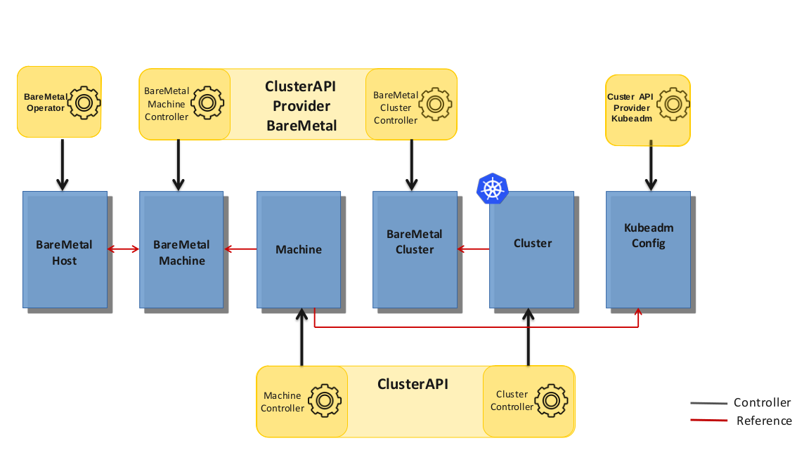
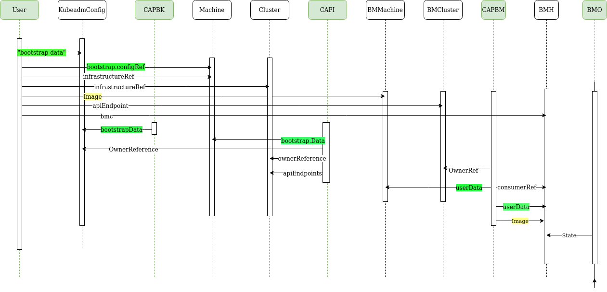

# Architecture

## Introduction

The ```cluster-api-provider-metal3 (CAPM3)``` is one of the controllers
involved in managing the life cycle of kubernetes clusters on Metal3
Machines. This document describes the components involved and their roles. It
also discusses the flow of information from one CR to another with the help of
the controllers. As to avoid ambiguity, we will refer to the physical or virtual
machines managed by the controllers as Bare Metal Servers. And, the kubernetes
resources (CRs) representing them as Metal3 Machines (M3M).

## Components

The ```cluster-api-provider-metal3 (CAPM3)``` controller is responsible for
watching and reconciling multiple resources. However, it is important to see
other controllers and custom resources (CRs) involved in the process. The
ultimate goal of the interaction between the controllers and CRs is to provision
a kubernetes cluster on Bare Metal Servers. To that end, the controllers
perform different actions on one or more relevant CRs.

The following diagram shows the different controllers and CRs involved. The
CAPI, CABPK and CAPM3 controllers are beyond the scope of this document.
With respect to CAPM3, we focus on what CRS it `watches` and `reconciles`. The
arrows in black show which CRs the controller `reconciles` while the one in red
show that a related controller is `watching` another CR.



As shown in the above Components' diagram, CAPM3 is watching for changes in
`Machine` CR and upon change, it makes changes on the `Metal3Machine` CR.
Similarly, it watches `Cluster` CR and makes changes on a related
`Metal3Cluster` CR.

The left most components, BMO controller and BareMetalHost(BMH) CR, are the
closest to the Bare Metal Server. If one wants to changes the state of a Metal3
Machine, they modify the BMH CR. Upon change to the BMH, BMO interacts
with Ironic to make changes on the Bare Metal Server.

During the initial introspection and state changes, the above logic works in the
 opposite direction as well. Information gathered during introspection or any
 state changes on the Bare Metal Server, results in BMO learning about the
 change(s) via Ironic and a chain of events starts. Once BMO learns about the
 changes, it makes the required
changes on the BMH.

As discussed above, the management of Bare Metal Servers requires the
interaction of multiple controllers via multiple CRs. However, the interaction
is performed on a specified number of fields on each CR. i.e. A controller
`watches` a specified number of fields in each CR and makes changes on a set of
 fields. Before seeing the relationship, we need to see the CRs at two
  stages, before and after provisioning a control plane machine.

---

### Cluster

Cluster, User provided Configuration

```yaml
apiVersion: cluster.x-k8s.io/v1beta1
kind: Cluster
metadata:
  name: test1
spec:
  clusterNetwork:
    services:
      cidrBlocks: ["10.96.0.0/12"]
    pods:
      cidrBlocks: ["192.168.0.0/18"]
    serviceDomain: "cluster.local"
  infrastructureRef:
    apiVersion: infrastructure.cluster.x-k8s.io/v1beta1
    kind: Metal3Cluster
    name: test1
```

Cluster, after reconciliation

```yaml
apiVersion: cluster.x-k8s.io/v1beta1
kind: Cluster
metadata:
  name: test1
  namespace: metal3
spec:
  clusterNetwork:
    pods:
      cidrBlocks:
      - 192.168.0.0/18
    serviceDomain: cluster.local
    services:
      cidrBlocks:
      - 10.96.0.0/12
  |----------------------------------------------------------------------------|
  |# infrastructureRef comes from 'Metal3Cluster' and is added by 'CAPM3'      |
  | infrastructureRef:                                                         |
  |  apiVersion: infrastructure.cluster.x-k8s.io/v1beta1                      |
  |  kind: Metal3Cluster                                                       |
  |  name: test1                                                               |
  |  namespace: metal3                                                         |
  |-----------------------------------------------------------------------------
status:
  apiEndpoints:
  - host: 192.168.111.249
    port: 6443
  controlPlaneInitialized: true
  infrastructureReady: true
  phase: provisioned
```

---

### Metal3Cluster

Metal3Cluster, User provided Configuration for

```yaml
apiVersion: infrastructure.cluster.x-k8s.io/v1beta1
kind: Metal3Cluster
metadata:
  name: test1
spec:
  apiEndpoint: https://192.168.111.249:6443
  noCloudProvider: true
```

Metal3Cluster, after reconciliation

```yaml
apiVersion: infrastructure.cluster.x-k8s.io/v1beta1
kind: Metal3Cluster
metadata:
  name: test1
  namespace: metal3
  |----------------------------------------------------------------------------|
  |# ownerReferences refers to the linked Cluster and is added by 'CAPM3'      |
  |ownerReferences:                                                            |
  |- apiVersion: cluster.x-k8s.io/v1beta1                                     |
  |  kind: Cluster                                                             |
  |  name: test1                                                               |
  |  uid: 193ec580-89db-46cd-b6f7-ddc0cd79636d                                 |
  |----------------------------------------------------------------------------|
spec:
  apiEndpoint: https://192.168.111.249:6443
  noCloudProvider: true
status:
  apiEndpoints:
  - host: 192.168.111.249
    port: 6443
  ready: true
```

---

### Machine

Machine, User provided Configuration

```yaml
apiVersion: cluster.x-k8s.io/v1beta1
kind: Machine
metadata:
  name: test1-controlplane-0
  labels:
    cluster.x-k8s.io/control-plane: "true"
    cluster.x-k8s.io/cluster-name: "test1"
spec:
  version: v1.17.0
  bootstrap:
    configRef:
      apiVersion: bootstrap.cluster.x-k8s.io/v1beta1
      kind: KubeadmConfig
      name: test1-controlplane-0
  infrastructureRef:
    apiVersion: infrastructure.cluster.x-k8s.io/v1beta1
    kind: Metal3Machine
    name: test1-controlplane-0
```

Machine, after reconciliation

```yaml
apiVersion: cluster.x-k8s.io/v1beta1
kind: Machine
metadata:
  labels:
    cluster.x-k8s.io/cluster-name: test1
    cluster.x-k8s.io/control-plane: "true"
  name: test1-controlplane-0
  namespace: metal3
  ownerReferences:
  - apiVersion: cluster.x-k8s.io/v1beta1
    kind: Cluster
    name: test1
    uid: 193ec580-89db-46cd-b6f7-ddc0cd79636d
spec:
  bootstrap:
    configRef:
      apiVersion: bootstrap.cluster.x-k8s.io/v1beta1
      kind: KubeadmConfig
      name: test1-controlplane-0
  |----------------------------------------------------------------------------|
  |# dataSecretName comes from Secret 'test1-controlplane-0'                   |
  |# & is added by 'CAPI'                                                      |
  | dataSecretName: test1-controlplane-0                                       |
  |----------------------------------------------------------------------------|
  infrastructureRef:
    apiVersion: infrastructure.cluster.x-k8s.io/v1beta1
    kind: Metal3Machine
    name: test1-controlplane-0
  providerID: metal3://8e16d3b6-d48c-41e0-af0f-e43dbf5ec0cd
  version: v1.17.0
status:
  addresses:
  - address: 172.22.0.10
    type: InternalIP
  - address: 192.168.111.21
    type: InternalIP
  - address: node-1
    type: Hostname
  - address: node-1
    type: InternalDNS
  bootstrapReady: true
  infrastructureReady: true
  nodeRef:
    name: node-1
  phase: running
```

---
### Metal3Machine

Metal3Machine, User provided Configuration

```yaml
apiVersion: infrastructure.cluster.x-k8s.io/v1beta1
kind: Metal3Machine
metadata:
  name: test1-controlplane-0
spec:
  image:
    url: http://172.22.0.1/images/bionic-server-cloudimg-amd64.img
    checksum: http://172.22.0.1/images/bionic-server-cloudimg-amd64.img.md5sum
```

Metal3Machine, after reconciliation

```yaml
apiVersion: infrastructure.cluster.x-k8s.io/v1beta1
kind: Metal3Machine
metadata:
  name: test1-controlplane-0
  namespace: metal3
  # ownerReferences refers to the linked Machine and is added by 'CAPM3'
  ownerReferences:
  - apiVersion: cluster.x-k8s.io/v1beta1
    kind: Machine
    name: test1-controlplane-0
spec:
  hostSelector: {}
  image:
    checksum: http://172.22.0.1/images/bionic-server-cloudimg-amd64.img.md5sum
    url: http://172.22.0.1/images/bionic-server-cloudimg-amd64.img
  providerID: metal3://8e16d3b6-d48c-41e0-af0f-e43dbf5ec0cd
  |----------------------------------------------------------------------------|
  |# dataTemplate comes from CR 'dataTemplate' and is added by 'CAPM3'         |
  |dataTemplate:                                                               |
  |  name: test1-workers-template                                              |
  |  namespace: metal3                                                         |
  |----------------------------------------------------------------------------|
status:
  addresses:
  - address: 172.22.0.10
    type: InternalIP
  - address: 192.168.111.21
    type: InternalIP
  - address: node-1
    type: Hostname
  - address: node-1
    type: InternalDNS
  ready: true
```

---

### BareMetalHost

BareMetalHost, User provided Configuration

```yaml
apiVersion: metal3.io/v1alpha1
kind: BareMetalHost
metadata:
  name: node-1
spec:
  online: true
  bootMACAddress: 00:b2:8c:ee:22:98
  bmc:
    address: ipmi://192.168.111.1:6231
    credentialsName: node-1-bmc-secret
```

BareMetalHost, after reconciliation

```yaml
apiVersion: metal3.io/v1alpha1
kind: BareMetalHost
metadata:
  name: node-1
  namespace: metal3
spec:
  bmc:
    address: ipmi://192.168.111.1:6231
    credentialsName: node-1-bmc-secret
  bootMACAddress: 00:b2:8c:ee:22:98
  |----------------------------------------------------------------------------|
  |# consumerRef refers to the linked Metal3Machine is added by 'CAPM3'        |
  |consumerRef:                                                                |
  |  apiVersion: infrastructure.cluster.x-k8s.io/v1beta1                      |
  |  kind: Metal3Machine                                                       |
  |  name: test1-controlplane-0                                                |
  |  namespace: metal3                                                         |
  |# Image comes from 'Metal3Machine' and is added by 'CAPM3'                  |
  |image:                                                                      |
  |  checksum: http://172.22.0.1/images/bionic-server-cloudimg-amd64.img.md5sum|
  |  url: http://172.22.0.1/images/bionic-server-cloudimg-amd64.img            |
  |online: true                                                                |
  |# UserData comes from 'Metal3Machine' and is added by 'CAPBK'               |
  |userData:                                                                   |
  |  name: test1-controlplane-0-user-data                                      |
  |  namespace: metal3                                                         |
  |----------------------------------------------------------------------------|
status:
  goodCredentials:
    credentials:
      name: node-1-bmc-secret
      namespace: metal3
  hardware: <Hardware related data>
  hardwareProfile: unknown

  operationHistory: ....
  operationalStatus: OK
  poweredOn: true
  provisioning:
    ID: 75450b93-0476-45b7-8629-d1eebbdc558b
    image:
      checksum: http://172.22.0.1/images/bionic-server-cloudimg-amd64.img.md5sum
      url: http://172.22.0.1/images/bionic-server-cloudimg-amd64.img
    state: provisioned
  triedCredentials:
    credentials:
      name: node-1-bmc-secret
      namespace: metal3
    credentialsVersion: "1435"
```

### KubeadmConfig

KubeadmConfig, user provided Configuration

```yaml
apiVersion: bootstrap.cluster.x-k8s.io/v1beta1
kind: KubeadmConfig
metadata:
  name: test1-controlplane-0
spec:
  initConfiguration:
    nodeRegistration:
      name: '{{ ds.meta_data.name }}'
      kubeletExtraArgs:
        node-labels: 'metal3.io/uuid={{ ds.meta_data.uuid }}'
  preKubeadmCommands: <list of commands>
  postKubeadmCommands: <list of commands>
  files: <list of files>
```

KubeadmConfig, after reconciliation

```yaml
apiVersion: bootstrap.cluster.x-k8s.io/v1beta1
kind: KubeadmConfig
metadata:
  name: test1-controlplane-0
  namespace: metal3
  ownerReferences:
  - apiVersion: cluster.x-k8s.io/v1beta1
    kind: Machine
    name: test1-controlplane-0
spec:
  clusterConfiguration:
    apiServer: {}
    apiVersion: kubeadm.k8s.io/v1beta1
    certificatesDir: /etc/kubernetes/pki
    clusterName: test1
    controlPlaneEndpoint: 192.168.111.249:6443
    controllerManager: {}
    dns:
      type: ""
    etcd: {}
    imageRepository: ""
    kind: ClusterConfiguration
    kubernetesVersion: v1.17.0
    networking:
      dnsDomain: cluster.local
      podSubnet: 192.168.0.0/18
      serviceSubnet: 10.96.0.0/12
    scheduler: {}
  files: <list of files>
  initConfiguration:
    nodeRegistration:
      kubeletExtraArgs:
        node-labels: metal3.io/uuid={{ ds.meta_data.uuid }}
      name: '{{ ds.meta_data.name }}'
  postKubeadmCommands: <list of commands>
status:
  |----------------------------------------------------------------------------|
  |bootstrapData: <user data in base64 format>                                 |
  |----------------------------------------------------------------------------|
  ready: true
```

---
#### Flow of information

As was shown on the above CRs, some of the fields are introduced in one CR and
they travel through multiple CRs to reach the BMH, which is the closest to the
Bare Metal Server. There is also a movement of information from the
virtual/physical machines towards the CRs, but this is beyond the scope of this
 document. Some of the fields are added by users, while the others are by the
 relevant controllers.

We have added the source of relevant fields as comments in the above yaml files.
The following sequence diagram shows the flow of information (fields) across
multiple CRs with the help of controllers.



#### Some relevant fields

```apiEndpoint:``` IP:Port of a load balancer (keepalived VIP)

```image:``` OS image for the Metal3 Machine

The following fields are used to make a relationship between CRs.

```bash
infrastructureRef
ownerReferences
consumerRef
```

The following fields refer to the cloud-init data, but the names change across
different CRs.

```bash
bootstrap
bootstrap.data
userData
bootstrapData
```
