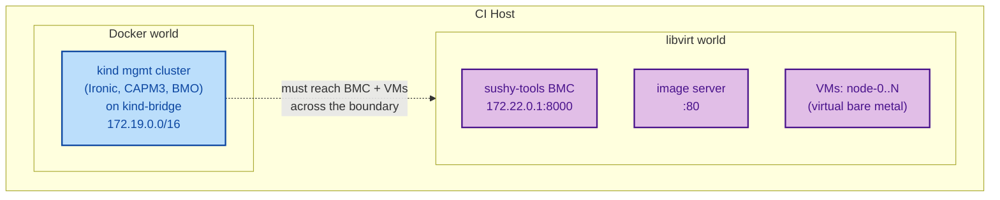
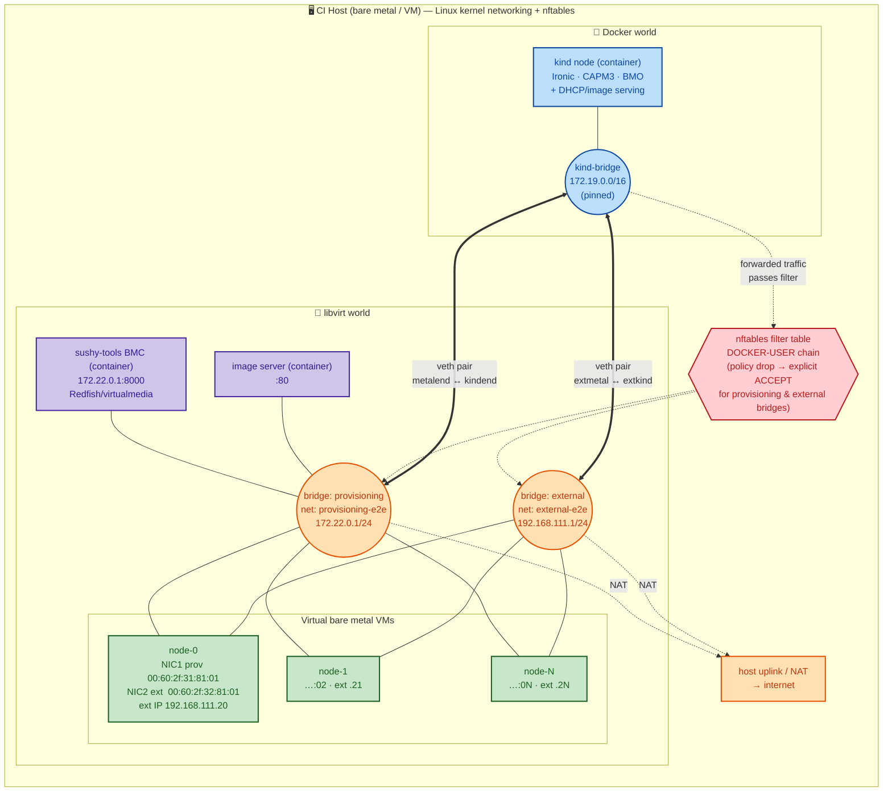
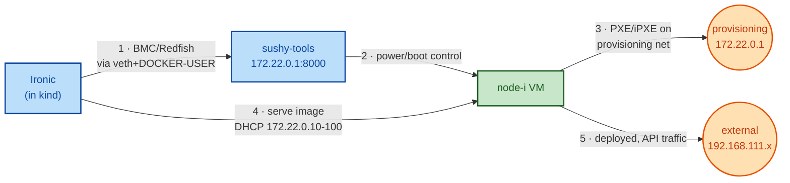

# E2E test networking

This document explains how the e2e test environment wires up networking. The
suite used to rely on [metal3-dev-env](https://github.com/metal3-io/metal3-dev-env)
to build all of the host bridges, NAT, firewall rules and the provisioning
network implicitly. The e2e tests now create that environment explicitly using
the [vbmctl](https://github.com/metal3-io/baremetal-operator) CLI, split between
a declarative topology (`test/e2e/config/vbmctl.yaml.tmpl`) and host-side glue in
the shell scripts (`hack/setup-bml.sh`).

## The two-world problem

The management cluster runs in **kind** (Docker networking), while the "bare
metal" hosts are **libvirt VMs** (libvirt networking). These are two separate L2
domains that must talk to each other: Ironic (inside kind) has to reach both the
BMC emulator and the VMs.

## Network topology

`vbmctl` creates two libvirt networks/bridges. Each VM is dual-homed (one NIC per
network with deterministic MAC addresses), and the two libvirt bridges are
stitched into the kind Docker bridge using veth pairs.

| Network            | Bridge     | Address          | Role                         |
| ------------------ | ---------- | ---------------- | ---------------------------- |
| `provisioning-e2e` | `provisioning` | `172.22.0.1/24`  | PXE / Ironic provisioning    |
| `external-e2e`     | `external` | `192.168.111.1/24` | tenant / API-server traffic |

Pinning the kind Docker network to a fixed subnet (`172.19.0.0/16`) gives the
veth pairs a stable, known target; previously kind picked an
arbitrary Docker network.

## End-to-end provisioning path

Putting it together, this is how Ironic reaches a virtual bare metal host to
provision it:

