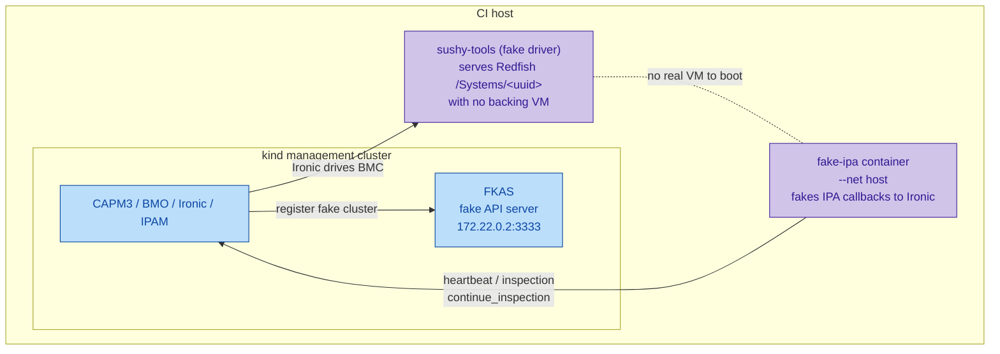
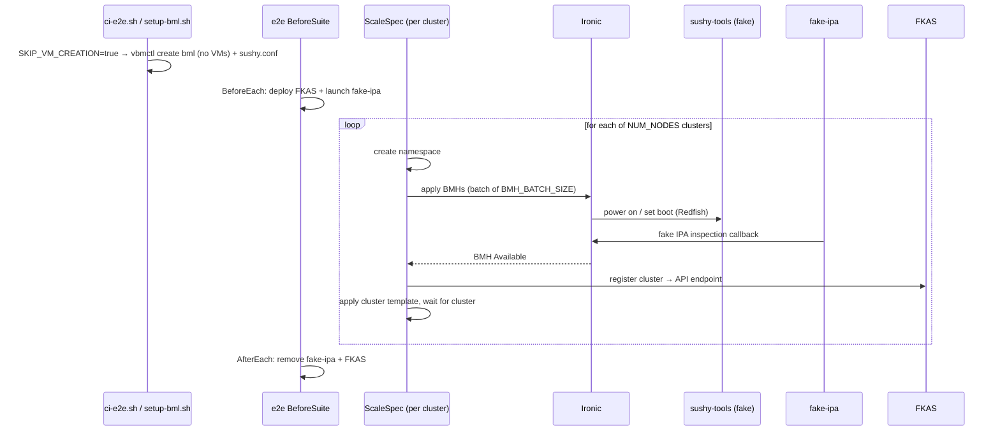

# Scalability e2e test

This document explains how the `scalability` e2e scenario works: what it
exercises, why it is "fully faked", and how the pieces fit together.

## What it tests

The scalability test measures how CAPM3 (and the surrounding Metal3 stack)
behaves when creating **many workload clusters and BareMetalHosts (BMHs) at
once**. It uses Cluster API's generic `capi_e2e.ScaleSpec` to create
`NUM_NODES` clusters (default `30`) concurrently, each in its own namespace,
and waits for the BMHs to become `Available` and the clusters to come up.

It is labelled `scalability` and is skipped by every other run
(`ci-e2e.sh` adds `scalability` to `GINKGO_SKIP` unless it is the focus).

Run it with:

```bash
GINKGO_FOCUS=scalability ./scripts/ci-e2e.sh
```

## Why everything is faked

Provisioning 30 real clusters on 30 real VMs would need enormous host resources
and would mostly measure QEMU/boot time, not CAPM3. So the scenario fakes the
three expensive, slow parts of the stack:

| Real component | Fake replacement | What it removes |
| -------------- | ---------------- | --------------- |
| Workload Kubernetes API server | **FKAS** (fake API server) | Real control-plane boot |
| BMC / Redfish + power/boot | **sushy-tools fake driver** | Real libvirt VMs |
| Ironic Python Agent (IPA) ramdisk | **fake-ipa** container | Real PXE boot + inspection |

The result: no libvirt VMs boot, yet BMHs still progress to `Available`/
`Provisioned` and clusters still reconcile, so the test exercises CAPM3, BMO,
Ironic and IPAM at scale.

## The moving parts



### 1. FKAS — fake workload API servers

Each workload cluster needs an API endpoint. Instead of booting a control
plane, the test deploys **FKAS** into the management cluster
(`createFKASResources()` in `test/e2e/scalability_test.go`) and, per cluster,
calls its `/register` endpoint (`registerFKASCluster`). FKAS returns a
host/port that is patched into the cluster template as the API endpoint, so CAPI
believes the workload API server is up.

### 2. sushy-tools fake driver — BMCs without VMs

`hack/setup-bml.sh` runs `vbmctl create bml` but, because the scalability case
sets `SKIP_VM_CREATION=true`, it defines only a single tiny placeholder VM
(never started) — just enough to satisfy vbmctl, which rejects an empty
`spec.vms` — so the networks, BMC emulator and image server come up **without a
real VM per node**. It also generates a sushy-tools config
(`_out/sushy.conf`) with:

- `SUSHY_EMULATOR_FAKE_DRIVER = True`
- `SUSHY_EMULATOR_FAKE_IPA = True`
- `SUSHY_EMULATOR_FAKE_SYSTEMS = [ … ]` — one entry per node, each with a real
  UUID as its id (sushy-tools parses the system id as a UUID, so a name like
  `node-0` would 500). The same UUID is used in the BMH BMC address
  (`.../redfish/v1/Systems/<uuid>`); the human-readable `name` stays `node-<i>`.

vbmctl bind-mounts that file into the sushy-tools container (via
`bmcEmulator.configFile`), so sushy-tools serves virtual Redfish systems that
respond to power/boot without any real machine behind them.

### 3. fake-ipa — completing inspection/provisioning

A BMH only reaches `Available` after Ironic inspects it, which normally requires
the node to PXE-boot the IPA ramdisk and call back. With no VM, nothing boots,
so the test launches the **fake-ipa** container (`launchFakeIPA()` in
`BeforeEach`). It runs on the host network and impersonates the agent, calling
Ironic's inspection/heartbeat endpoints (`…/v1/continue_inspection`). Because
fake-ipa talks plain HTTP, the scalability case also relaxes Ironic's agent TLS
requirement (`OS_AGENT__REQUIRE_TLS=false`, injected via the Ironic CR
`extraConfig`).

## Test flow



Key per-cluster logic lives in `postScaleClusterNamespaceCreated`
(`test/e2e/scalability_test.go`), which applies the right slice of BMHs in
batches of `BMH_BATCH_SIZE`, waits for them to become `Available`, registers the
cluster with FKAS, and rewrites the template's API endpoint placeholders.

## Relevant knobs

| Variable | Default | Meaning |
| -------- | ------- | ------- |
| `NUM_NODES` | `30` | Number of clusters/BMHs to create |
| `SCALE_SPEC_CONCURRENCY` | see e2e config | Parallel cluster creations |
| `BMH_BATCH_SIZE` | `2` | BMHs applied per batch |
| `CONTROL_PLANE_MACHINE_COUNT` | `1` | Control-plane machines per cluster |
| `WORKER_MACHINE_COUNT` | `0` | Workers per cluster |
| `SKIP_VM_CREATION` | `true` (scalability) | Skip real libvirt VMs |
| `FAKE_IPA_IMAGE` | `quay.io/metal3-io/fake-ipa:latest` | fake-ipa container image |

## Cleanup

- `fake-ipa` is removed in the test `AfterEach` and by `make clean-e2e`.
- FKAS is removed in `AfterEach`.
- The generated `_out/sushy.conf` lives under `_out/`, which
  `make clean-e2e` deletes.
